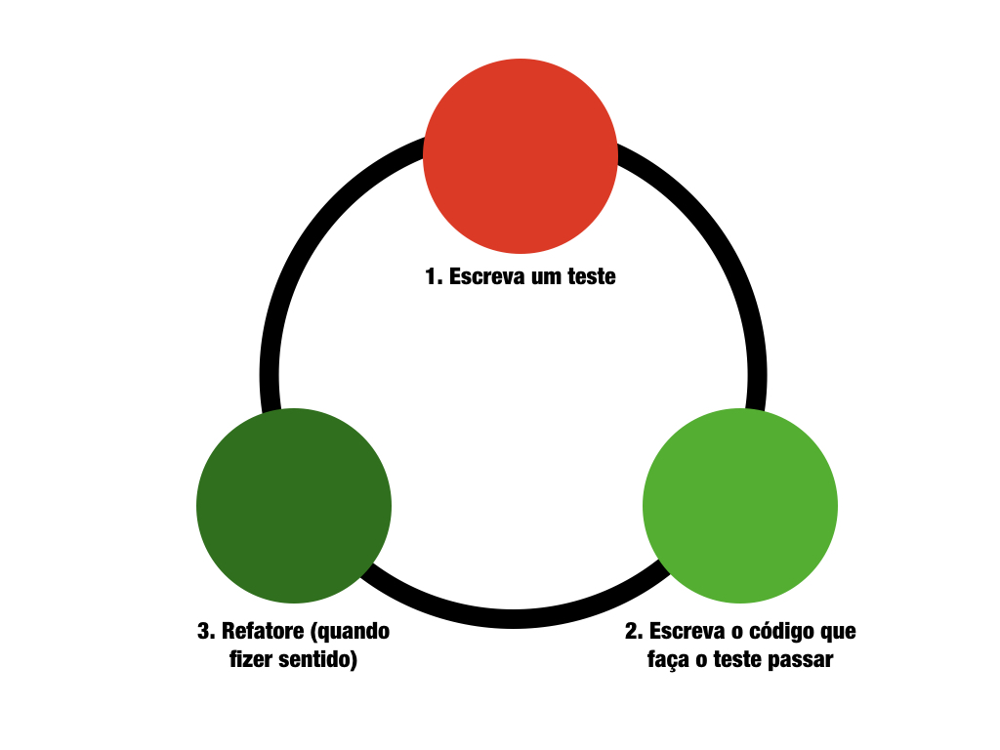

## Kata Conta Corrente
Esse é um kata planejado para exercitar as práticas de TDD e Pair Programming. Ele foi intencionalmente planejado para começar de maneira bem simples e gradativamente ter mais complexidade adicionada ao desafio e, por consequência, à solução. 

É esperado que no decorrer do exercício as pessoas construam código-fonte de solução e de teste. Todos estão livres para construir novas classes, métodos, funções, atributos, variáveis e testes a medida que isso lhes pareça conveniente. Mesmo tendo alguns exemplos de código-fonte inicial ao final desse documento, esse kata é agnóstico a linguagem de programação. 

## Conceitos
### Test Driven Development (TDD)
Test Driven Development (TDD) ou Desenvolvimento Guiado por Testes (em português) é uma técnica de desenvolvimento de software que se relaciona com os conceito de design de código e se baseia em um ciclo curto de repetições. Primeiramente o engenhiro de software escreve um caso de teste automatizado que define uma nova funcionalidade (ou melhoria desejada). Então, é produzido código que possa ser validado pelo teste. Para casos onde faça sentido, o código pode ser posteriormente refatorado para um código sob novos padrões, desde que mantenha o mesmo comportamento.

Para saber mais:
* Artigo da Wikipedia: https://pt.wikipedia.org/wiki/Test_Driven_Development



### Pair Programming
O Pair Programming (programação pareada ou ainda ou programação em par, em português) é uma técnica de desenvolvimento de software em que dois engenheiros de software trabalham juntos em uma mesma estação de trabalho. Um deles, chamado de *piloto*, escreve o código enquanto o outro, chamado de *navegador*, analisa o código que está sendo construído, contribuindo sempre que achar pertinente. É fundamental que os dois programadores troquem de papel em intervalos de tempo frequentes.

Para saber mais:
* Artigo da Wikipedia: https://pt.wikipedia.org/wiki/Programa%C3%A7%C3%A3o_pareada

## Como Executar
A ideia desse kata é que cada requisito seja feito pelos passos do TDD, segundo a escola Detroit: 
1. Primeiro o teste para a solução, que falhará.
1. Então o código-fonte de solução que resolva o teste e o faça passar. 
1. A medida que parecer interessante, pode haver um passo adicional de refatoração. 

Se o exercício for feito em par, o mecanismo adicional é ter uma troca de pares a cada vez que um dos requisitos for considerado entregue.


#### Requisito #1
Crie uma solução que seja capaz de depositar um valor em conta.


#### Requisito #2
Crie uma solução que seja capaz de sacar o valor de uma conta.


#### Requisito #3
Crie uma solução que tente sacar um valor maior que o saldo de uma conta, mas que não faça a operação.


#### Requisito #4
Crie uma solução que seja capaz de transferir um valor válido de uma conta para outra conta.


#### Requisito #5
Crie uma solução que tente transferir um valor inválido de uma conta para outra conta.


#### Requisito #6
Adicione o conceito de limite à conta. Modifique também os métodos de teste, se for preciso.


#### Requisito #7
Crie um forma de guardar todas as operações (saque, depósito e transferência) executadas em uma conta.


#### Requisito #8 (Extra para quem também quer aprender um pouco mais sobre a linguagem de programação)
Faça com que os atributos de conta não sejam acessíveis fora da própria classe.

<br>

## Material de Apoio
Abaixo, duas possibilidades para começar a resolução do kata. Uma em Java, outra em Python.

### Exemplos em Java

Exemplo inicial de Conta em Java (`Conta.java`)
```
public class Conta {
    int id;
    double saldo;
}
```


Exemplo inicial de teste de Conta em Java, usando jUnit (`TestaConta.java`)
```
import static org.junit.jupiter.api.Assertions.*;

public class TestaConta {
    
    @Test
    public void testaSaldo() {
        Conta contaTeste = new Conta();
        Assert.assertEquals(0, contaTeste);
    }

}
```


### Exemplos em Python

Exemplo inicial de Conta em Python (`Conta.py`)
```
    class Conta:

        def __init__(self, id):
            self.id = id
            self.saldo = 0
```


Exemplo inicial de teste de Conta em Python, usando unittest (`TesteConta.py`)
```
    import unittest
    from Conta import Conta


    class TesteConta(unittest.TestCase):

        def test_saldo(self):
            c = Conta(1)
            self.assertEqual(0, c.saldo)


    if __name__ == '__main__':
        unittest.main()
```

### Exemplos em Ruby

Exemplo inicial de Conta em Ruby (`ruby/conta.rb`).

Para a escrita dos testes foi utilizada a GEM [RSpec](https://rspec.info/).

Documento contendo boas práticas para escrita de testes: https://www.betterspecs.org/

Para rodar os testes: `cd ruby && make test`

### Exemplos em Swift

Exemplo inicial de Conta em Swift (`swift/Conta/conta.swift`).

Para a escrita dos testes foi utilizado o framework nativo XCTest [XCTest](https://developer.apple.com/documentation/xctest).

Documento contendo boas práticas para escrita de testes: https://www.betterspecs.org/

Para rodar os testes: `cd swift/Conta && swift test`

### Exemplos em Go

Exemplo inicial de Conta em Go (`go/conta.go`).

Os testes são escritos o framework de testes padrão da linguagem.

Para rodar os testes: `cd go && go test -v`

## Execuções
Esse kata já foi executado algumas vezes e algumas informações podem ser pertinentes para quem for repeti-lo, em conjunto ou mesmo de forma individual.
1. Pares com experiência foram capazes de fazer o exercício em um intervalo de tempo entre 60 - 80 minutos.
1. Pares sem experiência foram capazes de fazer o exercício em um intervalo de tempo entre 90 - 120 minutos.
1. Conjunto de programadores em estilo dojo ou mob progrraming foram capazes de fazer o exercício em um intervalo de tempo entre 90 - 120 minutos.

## Agradecimentos
Esse exercício existe e está em constante melhoria através do apoio direto e indireto de algumas pessoas. Entre elas:
* A inspiração original: [Greeting Kata](https://github.com/testdouble/contributing-tests/wiki/Greeting-Kata)
* Revisões de estilo de código e mensagens de commit por [Ceci Fernandes](http://cecifernandes.com) e [Gustavo Andriotti](https://github.com/fgka)
* Sugestões de vocabulário e formato para o exercício por [Elias Nogueira](http://www.eliasnogueira.com) e [Evandro F. Souza](https://medium.com/@evandroferreiras)
